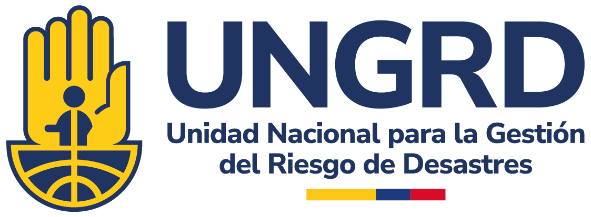

Ficha departamental de caracterización de escenarios de riesgo: Departamento de Córdoba. Bogotá, D.C., Unidad Nacional para la Gestión del Riesgo de Desastres, 2026. DOI: [DOI pendiente de asignación]
1. Gestión del riesgo de desastres—Córdoba (Colombia) 2. Ordenamiento territorial—gestión del riesgo departamental 3. Amenazas naturales, socio-naturales y tecnológicas—Córdoba 4. Caracterización ambiental y climática—Córdoba 5. Escenarios de riesgo—antecedentes históricos

------------------------------------------------------------------------

::: {style="line-height: 0.96;"}
**Gustavo Francisco Petro Urrego** \| Presidente de la República

**Carlos Alberto Carrillo Arenas** \| Director General,
Unidad Nacional para la Gestión del Riesgo de Desastres (UNGRD)

**Rafael Enrique Cruz Rodríguez** \| Subdirector General – UNGRD

**Ana Milena Prada Uribe** \| Subdirectora para el Conocimiento del Riesgo

------------------------------------------------------------------------

**Subdirección para el Conocimiento del Riesgo**

------------------------------------------------------------------------

Elaborado por \| Sandra Mendoza O., Andrés Tafur Castaño, Nicolás Espitia Rodríguez — Equipo técnico, Subdirección para el Conocimiento del Riesgo - UNGRD

Revisión técnica \| Pendiente — Subdirección para la Reducción del Riesgo de Desastres - UNGRD

Revisión de estilo \| Pendiente – UNGRD

Diseño editorial \| Iván Merchán Rodríguez – UNGRD

DOI: [DOI pendiente de asignación]

Copyright: © Unidad Nacional para la Gestión del Riesgo de Desastres, 2026. Bogotá, Colombia

**Citación sugerida**: Unidad Nacional para la Gestión del Riesgo de Desastres, Subdirección para el Conocimiento del Riesgo. 2026. *Ficha departamental de caracterización de escenarios de riesgo: Departamento de Córdoba.* Unidad Nacional para la Gestión del Riesgo de Desastres. Bogotá, D.C., Colombia.

Todos los derechos reservados. Excepto si se señala otra cosa, la licencia del ítem se describe como Atribución. NoComercial-SinDerivadas 2.5 Colombia. Distribución gratuita – versión digital
:::

{fig-align="center" width="300"}
