# 2. CARACTERIZACIÓN TERRITORIAL Y AMBIENTAL

------------------------------------------

### 2.1. Ubicación y límites.

El departamento de Córdoba está ubicado en la región Caribe de Colombia,
es decir Córdoba se ubica al noroccidente del territorio colombiano. Sus
límites geográficos son para la zona Este con los departamentos de Sucre
y Bolívar, al Sur y Suroeste con Antioquia, y al Oeste con el mar Caribe
(ver Figura 1).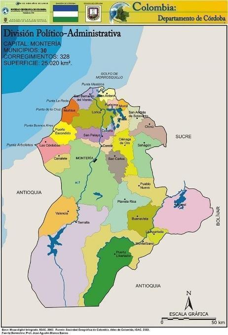{width="2.097916666666667in"
height="3.154166666666667in"}

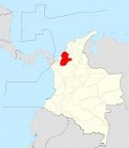{width="3.6875in" height="2.888888888888889in"}

######## Figura 1 Mapa Político Administrativo del Departamento de Córdoba. Fuente: IGAC (2002).

*link:
[[https://www.todacolombia.com/departamentos-de-colombia/cordoba/municipios-division-politica.html]{.underline}](https://www.todacolombia.com/departamentos-de-colombia/cordoba/municipios-division-politica.html)*

El relieve del departamento de Córdoba se compone de tres zonas
principales: las planicies fluviales de los ríos Sinú y San Jorge, que
atraviesan municipios como Montería, Lorica y Ayapel. La zona montañosa,
que hace parte de la Cordillera Occidental, donde se destacan las
serranías de Abibe, Ayapel y San Jerónimo, visibles en municipios como
Tierralta y Valencia; y las zonas costero-marinas, localizadas en el
norte del departamento, en municipios como San Antero, Moñitos y Los
Córdobas. Estas tres unidades definen la geografía y usos del suelo en
la región.

### 2.2. Extensión de superficie (Km2).

El departamento de Córdoba cuenta con una superficie aproximada de
25.020 kilómetros cuadrados, lo que lo convierte en una de las entidades
territoriales de tamaño intermedio en el país.

### 2.3. División político-administrativa.

El departamento de Córdoba presenta una distribución para 30 municipios,
la siguiente tabla mencionada el total de los municipios (Ver Tabla 1):

[]{#_Toc216552971 .anchor}

Tabla 1 Municipios del departamento de Córdoba. Fuente: Autor (2025).

  -------- ------------------- -------- ----------------- -------- --------------- -------- ------------------------- -------- --------------- -------- -------------------------
  N°   Municipio       N°   Municipio     N°   Municipio   N°   Municipio             N°   Municipio   N°   Municipio
  1        Montería            6        Ayapel            11       Buenavista      16       Canalete                  21       Cereté          26       Chimá
  2        Chinú               7        Ciénaga de Oro    12       Cotorra         17       La Apartada               22       Lorica          27       Los Córdobas
  3        Momil               8        Montelíbano       13       Moñitos         18       Planeta Rica              23       Pueblo Nuevo    28       Puerto Escondido
  4        Puerto Libertador   9        Purísima          14       Sahagún         19       San Andrés de Sotavento   24       San Antero      29       San Bernardo del Viento
  5        San Carlos          10       San José de Uré   15       San Pelayo      20       Tierralta                 25       Tuchín          30       Valencia
  -------- ------------------- -------- ----------------- -------- --------------- -------- ------------------------- -------- --------------- -------- -------------------------

### 2.4. Población y demografía

La información presentada a continuación fue recopilada a través del
Sistema de Estadística Territorial (TERRIDATA), una plataforma del
Departamento Nacional de Planeación (DNP) que centraliza datos
relevantes para el análisis y la planificación del desarrollo
territorial en Colombia.

> 2. 4.1. Habitantes totales.

Según estimaciones del Departamento Administrativo Nacional de
Estadística (DANE) para el año 2024, el departamento de Córdoba cuenta
con una población aproximada de 1.914.778 habitantes.

La población del departamento de Córdoba se caracteriza por ser
mayoritariamente joven, con una base amplia en los grupos de edad entre
0 y 19 años, lo que refleja un alto índice de natalidad. A medida que
aumentan las edades, se observa una disminución progresiva en el número
de habitantes, lo que indica un proceso de envejecimiento gradual de la
población.

 

> 2.4.2. Crecimiento poblacional y proyecciones.

La proyección para el año 2035 es de 2.038.014 habitantes, mostrando un
crecimiento moderado de la población, acompañado de una transición hacia
el envejecimiento. Si bien la franja de edad productiva (20 -- 39 años)
se amplía, la reducción en la base de la pirámide sugiere una
disminución en la tasa de natalidad.  

En cuanto a la distribución por género, se evidencia que las mujeres
tienden a vivir más que los hombres, siendo más numerosas en los grupos
de edad de 70 años en adelante, lo que corresponde con una mayor
esperanza de vida femenina. En lo que respecta a la ubicación de la
población, se identifica que tiene porcentajes similares en lo que
respecta a la zona rural (48,9%) de la urbana (51,1%).

  ----------------------------------------------------------------------------------- -------------------------------------------------------------------------------------
  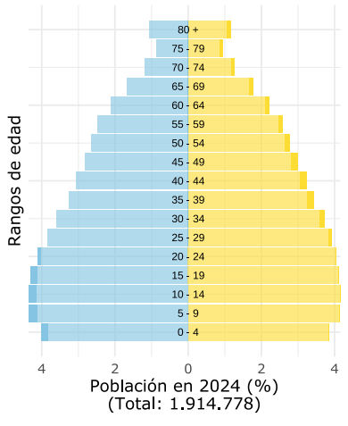{width="2.302589676290464in" height="2.583902012248469in"}   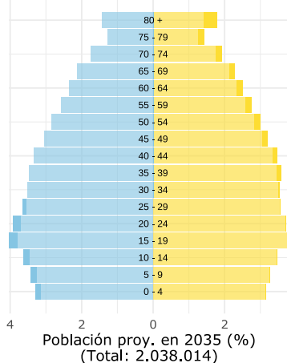{width="2.133400043744532in" height="2.4917443132108485in"}
  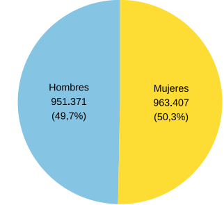{width="2.010886920384952in" height="1.81709208223972in"}    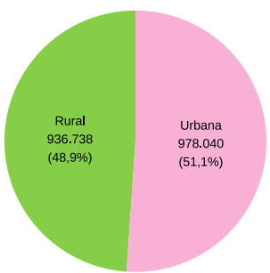{width="1.8067639982502188in" height="1.8755336832895888in"}
  ----------------------------------------------------------------------------------- -------------------------------------------------------------------------------------

[]{#_Toc216554590 .anchor}Figura 2 Distribución demográfica del
departamento de Córdoba.
FUENTE: Tomado de la proyección DANE (2024), pg. 1 y 2. *
*

LINK:
[[https://terridata.blob.core.windows.net/fichas/Ficha_23000.pdf]{.underline}](https://terridata.blob.core.windows.net/fichas/Ficha_23000.pdf)  

### 2.5. Actividades económicas.

SECTORES PRODUCTIVOS PREDOMINANTES.

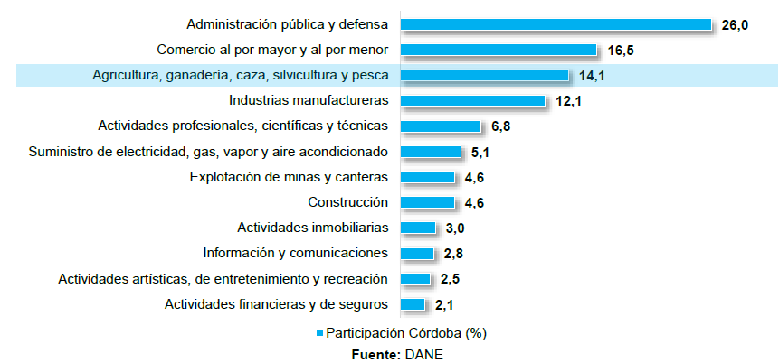{width="4.617115048118985in"
height="2.625254811898513in"}

######## Figura 3 Participación por actividad económica en el departamento de Córdoba. 2022. Fuente: UPRA-DANE, pg. 8.

*LINK:
[[https://upra.gov.co/Kit_Territorial/2-%20Informaci%C3%B3n%20por%20Departamentos/C%C3%93RDOBA/2-%20Documento%20Regional%20UPRA%20C%C3%B3rdoba.pdf]{.underline}](https://upra.gov.co/Kit_Territorial/2-%20Informaci%C3%B3n%20por%20Departamentos/C%C3%93RDOBA/2-%20Documento%20Regional%20UPRA%20C%C3%B3rdoba.pdf)*

De acuerdo con datos de la Unidad de Planificación Rural Agropecuaria
(UPRA, 2022), las principales actividades económicas del departamento de
Córdoba muestran una alta dependencia del sector público, siendo la
administración pública y defensa la que mayor participación tiene en el
valor agregado bruto, con un 26%.

En segundo lugar, se encuentra el sector de comercio al por mayor y al
por menor, que representa un 16,5%, seguido por el sector de
agricultura, ganadería, caza, silvicultura y pesca, con una
participación del 14,1%, lo que resalta la relevancia del sector
primario en la economía regional.

Las industrias manufactureras contribuyeron con un 12,1% al valor
agregado bruto del departamento, consolidándose como un pilar del
desarrollo industrial en la región. Otros sectores con participación
relevante fueron las actividades profesionales, científicas y técnicas
con un 6,8%, el suministro de energía eléctrica, gas y agua con un 5,1%,
y tanto la explotación de minas y canteras como la construcción, cada
una con un 4,6%.

En contraste, sectores como las actividades inmobiliarias, las
comunicaciones, el entretenimiento y los servicios financieros
registraron una participación inferior al 3,5% cada uno, aunque siguen
representando un componente importante dentro de la estructura económica
departamental.

### 2.6. Instrumentos territoriales de ordenamiento, planificación ambiental y gestión del riesgo.

A.  Plan de desarrollo departamental.

-   Plan de Desarrollo Departamental "Córdoba lo tiene todo para estar a
    otro nivel 2024-2027"

-   *Link:
    <https://www.cordoba.gov.co/loader.php?lServicio=Tools2&lTipo=descargas&lFuncion=visorpdf&id=14999&pdf=1>*

B.  Planes municipales de ordenamiento territorial.

[]{#_Toc216552972 .anchor}Tabla 2 Instrumentos de ordenamiento
territorial municipal.

  Municipio             Instrumento (POT/PBOT/EOT)   Año de vigencia                          Estado (vigente/desactualizado)
  ------------------------- -------------------------------- -------------------------------------------- -------------------------------------
  Montería                  POT                              2021                                         Actualizado
  Ayapel                    PBOT                             2015 (ajuste) / 2014-2029 (PBOT publicado)   Actualizado
  Buenavista                EOT                              2016 - 2027                                  Actualizado
  Canalete                  EOT                              2001 - 2010                                  Desactualizado
  Cereté                    PBOT                             2012 - 2023                                  Actualizado
  Chimá                     EOT                              2003 - 2012                                  Desactualizado
  Chinú                     PBOT                             2000 - 2010                                  Desactualizado
  Ciénaga de Oro            PBOT                             2019                                         Desactualizado
  Cotorra                   EOT                              2004 - 2012                                  Desactualizado
  La Apartada               EOT                              2017                                         Desactualizado
  Lorica                    POT                              2012 - 2015                                  Desactualizado
  Los Córdobas              EOT                              2014 - 2027                                  Actualizado
  Momil                     EOT                              2001                                         Desactualizado
  Montelíbano               PBOT                             2019                                         Actualizado
  Moñitos                   PBOT                             2019 - 2031                                  Actualizado
  Planeta Rica              PBOT                             2017                                         Desactualizado
  Pueblo Nuevo              PBOT                             2017 - 2031                                  Actualizado
  Puerto Escondido          PBOT                             2016 - 2027                                  Actualizado
  Puerto Libertador         EOT                              2014 - 2019                                  Desactualizado
  Purísima                  EOT                              2020 - 2023                                  Desactualizado
  Sahagún                   POT                              2001 - 2014                                  Desactualizado
  San Andrés de Sotavento   PBOT                             2001 - 2010                                  Desactualizado
  San Antero                PBOT                             2007                                         Desactualizado
  San Bernardo del Viento   PBOT                             2002                                         Desactualizado
  San Carlos                EOT                              2005 - 2019                                  Desactualizado
  San José de Uré           EOT                              2016 - 2019                                  Desactualizado
  San Pelayo                PBOT                             2000 - 2009                                  Desactualizado
  Tierralta                 PBOT                             2011 - 2023                                  Desactualizado
  Tuchín                    PBOT                             2015 - 2027                                  Actualizado
  Valencia                  PBOT                             2017                                         Desactualizado

C.  Planes Ambientales.

-   Plan de Gestión Ambiental Regional, 2020-2031.

> Elaborado por: Corporación Autónoma de los Valles del Sinú y San
> Jorge.
>
> Link:
> <https://cvs.gov.co/download/775/participa/16159/plan-de-gestion-ambiental-regional-2020-2031-2.pdf>

-   Planes de Ordenación y Manejo de Cuencas Hidrográficas (POMCA).

El recurso hídrico dentro de la jurisdicción de la Corporación, se
encuentran definidas por el Instituto de Hidrología, Meteorología y
Estudios Ambientales - IDEAM, siete (7) cuencas hidrográficas
conformadas por: Rio Alto Sinú, Rio Medio-Bajo Sinú, Rio Alto San Jorge,
Rio Bajo San Jorge, Rio Canalete- Rio Los Córdobas, Rio Mangle y otros
arroyos directos del Caribe y Arroyos directos Golfo de Morrosquillo,
éste último sólo una pequeña porción del área geográfica está dentro del
departamento de Córdoba.

[]{#_Toc216552973 .anchor}Tabla 3 Instrumentos POMCA en el departamento.
Fuente: CVS (2024)

  ----------------------------------------------------- ------------ --------------- ----------------- -------------------------------------------------------------------------------------------------------------
  Nombre POMCA                                      Código   Hectáreas   Fase          LINK
  Rio Canalete, Los Cordobas y otros Arroyos - NSS      1204-1       119.138         Formulación       <https://cvs.gov.co/convocatoria-observaciones-pomca-rio-canalete-rio-los-cordobas-y-otros-arroyos-1204-1/>
  Rio Mangle y otros arroyos directos al Caribe - NSS   1204-02      62.781          No identificada   
  Rio Alto Sinú                                         1301         376.410         Formulación       <https://www.anla.gov.co/documentos/biblioteca/27-01-2021-anla-rash-rio-sinu-alto-san-jorge.pdf>
  Río Medio y Bajo Sinú - 2SZH                          1303         941.476         Formulación       <https://www.anla.gov.co/documentos/biblioteca/27-01-2021-anla-rash-rio-sinu-alto-san-jorge.pdf>
  Rio San Jorge                                         2502-01      994.778         Formulación       <https://www.corpomojana.gov.co/download/pomca/pomca-documento-2502-01.pdf>
  ----------------------------------------------------- ------------ --------------- ----------------- -------------------------------------------------------------------------------------------------------------

-   POMIUAC/Planes de Ordenación y Manejo Integrado de la Unidad
    Ambiental Costera Unidad Ambiental Costera Estuarina del Río Sinú y
    el Golfo de Morrosquillo.

La costa cordobesa se extiende desde la punta de Arboletes en límites
con Antioquia hasta Punta de Piedra en límites con Sucre, sobre el golfo
de Morrosquillo, recorriendo los municipios de Los Córdobas, Puerto
Escondido, San Bernardo del Viento, Moñitos y San Antero. En total son
124 km de costa y 6 km en promedio de anchura. Las zonas costeras, como
componentes esenciales e integrales de la tierra, se constituyen en
áreas críticas para el bienestar ambiental, económico y social de las
naciones que las poseen (Kay y Alder, 2005; CicinSain et al., 2006).

Estos espacios con características únicas, dadas sus condiciones de
intercambio de materia y energía entre la tierra, atmósfera y mar, que
propician el desarrollo de ecosistemas y hábitats costeros (deltas,
estuarios, lagunas, manglares, playas, pantanos de agua dulce, ríos y
bosque costeros); que proporcionan valiosos productos y servicios para
cubrir las necesidades económicas y de subsistencia para comunidades
locales y externas (Gilman et al., 2008).

[]{#_Toc216552974 .anchor}Tabla 4 Instrumento de Adaptación al Cambio
Climático. Fuente: Autor (2025).

  ------------------------------------------------------------------------------------------------- -------------------------- -------------------------- ---------------------------------------------------------------------------------
  INSTRUMENTO                                                                                   FECHA DE ELABORACIÓN   ÚLTIMA ACTUALIZACIÓN   LINK
  Plan Departamental de Adaptación al Cambio Climático para el Departamento de Córdoba 2016-2027.   2016                       2016                       <https://aquadocs.org/bitstream/handle/1834/6633/Cartilla-UAC_Morrosquillo.pdf>
  ------------------------------------------------------------------------------------------------- -------------------------- -------------------------- ---------------------------------------------------------------------------------

D.  Instrumentos de Gestión del Riesgo de desastres.

[]{#_Toc216552975 .anchor}Tabla 5 Instrumentos departamentales de
planificación en Gestión del Riesgo de Desastres.

  -------------------------------------------------------------------- -------------------------- -------------------------- -----------------------------------------------------------------------------------------------------------
  TIPO DE INSTRUMENTO                                              FECHA DE ELABORACIÓN   ÚLTIMA ACTUALIZACIÓN   LINK
  Plan Departamental para la Gestión del Riesgo de Desastre. (PDGRD)   2012                       2022                       <https://www.cordoba.gov.co/loader.php?lServicio=Tools2&lTipo=descargas&lFuncion=visorpdf&id=28471&pdf=1>
  Estrategia Departamental de Respuesta (EDRE)                         2012                       2024                       <https://www.cordoba.gov.co/loader.php?lServicio=Tools2&lTipo=descargas&lFuncion=visorpdf&id=28470&pdf=1>
  -------------------------------------------------------------------- -------------------------- -------------------------- -----------------------------------------------------------------------------------------------------------

## 2.7. Caracterización física del territorio.
-------------------------------------------

### 2.7.0. Características Geológicas 

Para el componente geológico del departamento fue necesario la revisión
de información disponible en la entidad técnica competente, es decir, el
Servicio Geológico Colombiano (SGC) El Servicio Geológico Colombiano
(SGC) ha desarrollado un geoportal para brindar la información geo
científica del país, por ejemplo, con la cartografía geológica de
Colombia a escala 1:1'500.000 (Ver la Figura 4), y en una escala más
detallada, por ejemplo, la plancha geológica 62 -- La Ye, la cual abarca
un área aproximada de 1.800 kilómetros cuadrados; esta zona se encuentra
ubicada en la región de frontera entre los departamentos de Córdoba y
Sucre.

A continuación, se anexa una visualización del geoportal o portal web
elaborado por técnicos y expertos del Servicio Geológico Colombiano
(SGC), para el uso y conocimiento libre de información geológica de todo
el territorio colombiano, a escala 1:1'500.000. El link de acceso al
portal web se anexa en las referencias del documento.

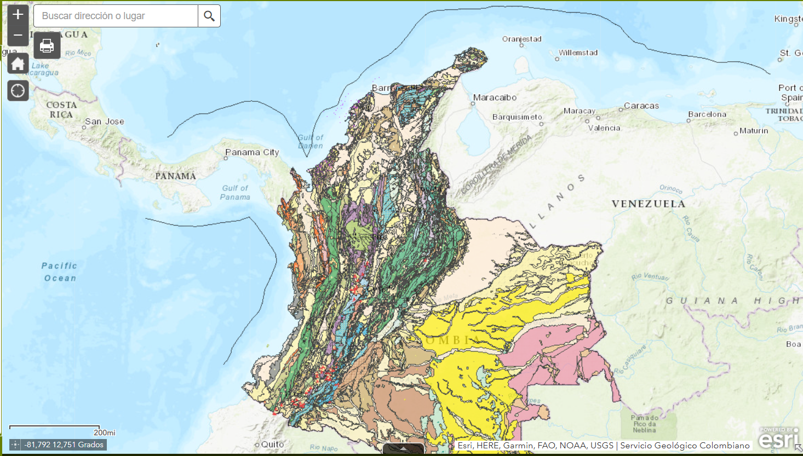{width="4.316744313210848in" height="2.7in"}

######## Figura 4 MAPA GEOLOGICO DE COLOMBIA, ESCALA 1:1'500.000. FUENTE: Gómez, J., Montes, N.E. & Marín, E., compiladores. 2023.

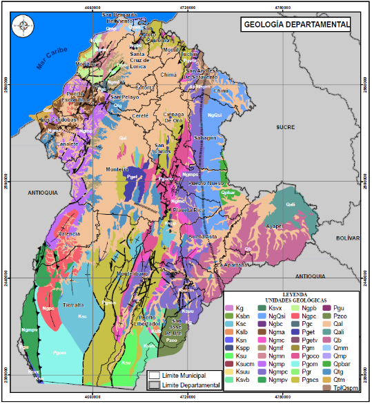{width="3.3833333333333333in" height="3.775in"}

######## Figura 5 Mapa geológico de Córdoba, pagina 74. FUENTE: Plan Departamental de Gestión del Riesgo de Desastres - PDGRD (2022 - 2031), pg. 82.

*Link:
[[https://drive.google.com/drive/folders/1xR_GkW_4eMc55gBeZLUSJ7mjdjfWr0x8]{.underline}](https://drive.google.com/drive/folders/1xR_GkW_4eMc55gBeZLUSJ7mjdjfWr0x8)*

El mapa elaborado por la Corporación del Valle del Sinú Corporación
Autónoma Regional de los Valles del Sinú y del San Jorge (CVS) muestra
una gran variedad de formaciones geológicas, lo que significa que en
Córdoba hay muchas clases de rocas y suelos que se formaron en
diferentes épocas de la historia de la Tierra. Existe una diversidad de
rocas en el departamento y está compuesto por más de 30 unidades
geológicas diferentes, cada una representada con un color distinto.

Estas unidades geológicas incluyen rocas volcánicas, sedimentarias,
ígneas y metamórficas, lo que indica una historia geológica compleja y
muy rica.

Al sur y suroccidente de Córdoba (frontera con Antioquia y el municipio
de Tierra Alta), se observa un predominio de colores verdes, azules y
marrones oscuros, que corresponden a rocas antiguas y montañosas.
Mientras que, al norte y noreste (como Montería, Lorica, Sahagún), hay
colores más uniformes, como los beige y grises claros, lo que indica
zonas más planas y jóvenes, como las llanuras costeras y valles, existen
deposición de sedimentos del río San Jorge y sus tributarios, además de
los depósitos asociados al sistema de ciénagas de Ayapel y sus
alrededores. 

### 2.7.1. Características geomorfológicas generales. 

El departamento de Córdoba forma parte de la Gran Llanura del Caribe y
presenta dos grandes zonas topográficas o tipos de paisaje:

-   Zona de planicies o sábanas

Esta zona está formada principalmente por tierras planas con algunas
colinas bajas, cuya altitud no supera los 100 metros sobre el nivel del
mar (msnm). El suelo está compuesto por materiales arcillosos y
arenosos, propios del Grupo geológico Sincelejo. La distribución al
norte y centro: predominan los valles aluviales del Sinú y San Jorge,
con espacios planos y bien drenados.

En esta región los valles aluviales de los ríos Sinú y San Jorge, así
como la franja costera del norte del departamento son una zona apta para
actividades agropecuarias, pero también sensible a inundaciones en
épocas de lluvia intensa.

(Fuente: CVS, 2022--2031)

-   Zona montañosa y de colinas

Esta región está ubicada al sur y suroccidente de Córdoba y corresponde
a las estribaciones (parte final) de la Cordillera Occidental. Se
caracteriza por tener cerros con cimas redondeadas, lo que indica la
presencia de rocas más resistentes a la erosión, como las de las
formaciones Ciénaga de Oro, Porquera y el Miembro Superior del Grupo
Sincelejo. Aquí se encuentran pendientes entre 16° y 25° y altitudes que
van de 100 a 200 msnm, lo que representa un relieve más quebrado y
complejo. Estas condiciones requieren especial atención para la gestión
del riesgo y el uso del suelo. (Fuente: SGC, 2013)

### 2.7.2. Características Generales del Uso del Suelo.

Es fundamental conocer cómo se usa el suelo en el departamento de
Córdoba, ya que esta información está relacionada con los recursos
naturales y las reservas del territorio. Según la Corporación Autónoma
Regional de los Valles del Sinú y del San Jorge (CVS), en el año 2023,
el departamento contaba con un total de 1.874.552 hectáreas destinadas a
actividades agrícolas, lo que representa el 75% del área total del
departamento. Por otro lado, el 6,2% del territorio está cubierto por
bosques naturales o zonas que no se usan para la agricultura, y el 18,8%
corresponde a áreas protegidas por la ley, en las que no se permite el
uso agropecuario.

A continuación, se muestra la distribución del uso del suelo en Córdoba:

  ------------------------------------------- ----------------------
  Uso de Suelo                            Superficie (Has)
  Frontera agrícola nacional                  1.874.552
  Bosque naturales y áreas no agropecuarias   155.189
  Exclusiones legales                         470.118
  ------------------------------------------- ----------------------

[]{#_Toc216552976 .anchor}Tabla 6. Tipos de uso de suelo en el
Departamento de Córdoba. Fuente: CVS (2023)

### 2.7.3. Características de la Geología Económica.

En los primeros años del siglo XXI, el sector agropecuario sigue siendo
el de mayor participación dentro del PIB del departamento de Córdoba, y
la ganadería bovina su principal actividad económica. Por su parte,
desde la década de 1980 la minería se convirtió en la segunda actividad
productiva del departamento, jalonada esencialmente por la explotación
de los yacimientos de ferroníquel. (Fuente: Banco de la República, 2004)

Es importante resaltar que, desde el 2014, el sector minero-energético
en cabeza del Ministerio de Minas y Energía ha venido desarrollando
proyectos encaminados al fortalecimiento de capacidades respecto a la
Gestión del Riesgo de Desastres. A lo largo de las últimas décadas, el
Estado ha realizado avances sobre la identificación, caracterización y
priorización de factores del riesgo del sector, tanto desde la óptica de
rol pasivo como activo, y la participación progresiva en las instancias
de coordinación del Sistema Nacional de Gestión del Riesgo de Desastres
(SNGRD). *Fuente: Política de Gestión del Riesgo de Desastres del sector
minero-energético, 2021.*

### 2.7.4. Características de los Yacimientos Minerales.

Según *Viloria De La Hoz:* La economía minera en el departamento de
Córdoba está constituida por la explotación de cuatro recursos:
Ferro-níquel, oro, gas natural y carbón. En el periodo 1994-2001 la
actividad minera, jalonada por la producción minera de ferroníquel,
registrando a una tasa de 9.3% promedio anual; mientras que en el año
1998 la minería departamental tuvo un crecimiento del 38%. El carbón de
Córdoba es demandado por la planta de ferroníquel de Cerro Matoso, y la
industria cementera de la región Caribe. (Fuente: Viloria de la Hoz, J.,
2004)

En relación con la actividad minera, según el reporte de la Agencia
Nacional de Minería (ANM), en Córdoba para 2019, en el catastro minero
se encuentran vigentes 115 títulos que corresponde a un 4,34% del total
de títulos en Colombia, distribuidos en 19 municipios, con una extensión
de 180.186,16 hectáreas, lo que corresponde a un 7,51 % de la extensión
total del departamento. El 40% de estos títulos es mediana minería, el
29,4% pequeña minería, 23% autorizaciones temporales y 7,6% de gran
minería.

Así mismo, según títulos mineros concesionados en Córdoba están
divididos por un 44,76% de materiales de construcción, un 25,71% de oro,
metales preciosos y cobre, un 14,29% de Carbón, un 11,43% de otros
minerales como calizas, arenas y gravas, y un 3,81% de níquel (Ordenanza
0009, 2020).

### 2.7.5. Características de los Yacimientos de tipo Hidrocarburos.

Según el Acuerdo 11 de 2008 de la Agencia Nacional de Hidrocarburos
(ANH) se establece un marco metodológico estandarizado para la técnica
de recursos y reservas de hidrocarburos en Colombia. Este acuerdo,
expedido por el Consejo Directivo de la ANH, define la forma, contenido,
plazos y métodos de valoración de dichos recursos y reservas
energéticas.

Para Colombia se establecen actualmente 23 cuencas sedimentarias
identificadas con potencial petrolero y para hidrocarburos no
convencionales en Colombia. Entre ellas, destacan la cuenca Sinú‑San
Jacinto por sus reservas de gas no convencional (CBM y áreas en
exploración), mientras que otras como las del Magdalena y Llanos
Orientales son ya cuencas maduras con exploración convencional y no
convencional en desarrollo. La cuenca sedimentaria correspondiente al
departamento de Córdoba es la cuenca Sinú-San Jacinto (SSJ) con 69.221
kilometros cuadrados, 205 pozos y 3 campos de explotación de gas. (Ver
la Figura 6)

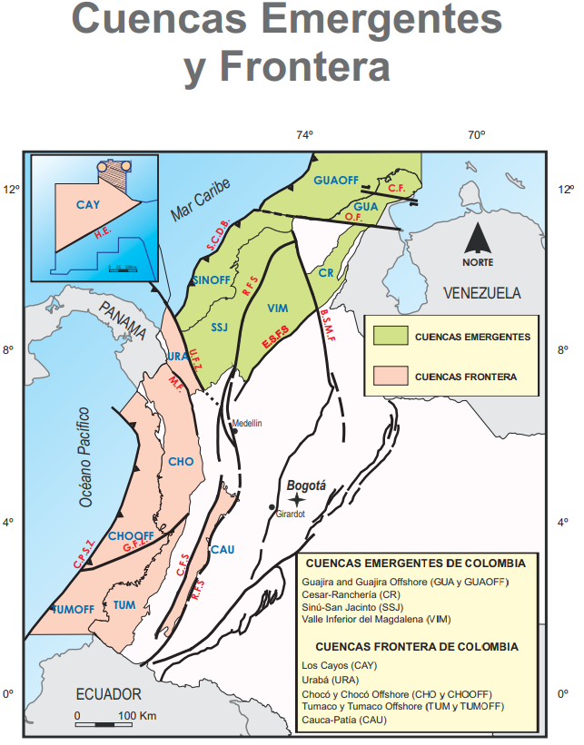{width="3.10625in"
height="3.0166666666666666in"}

######## Figura 6 Cuencas sedimentaria Sinú-San Jacinto (SSJ) en el departamento de Córdoba. FUENTE: ANH (2011)

Link:[[https://www.anh.gov.co/documents/4172/Cuencas_Sedimentarias_de_Colombia_PDF.pdf?utm_source=chatgpt.com]{.underline}](https://www.anh.gov.co/documents/4172/Cuencas_Sedimentarias_de_Colombia_PDF.pdf?utm_source=chatgpt.com)

Mediante el Acuerdo 04 de 2017, la Agencia Nacional de Hidrocarburos
(ANH) abrió la posibilidad a los interesados de acceder a 15 áreas
continentales disponibles, ubicadas en la cuenca sedimentaria Sinú-San
Jacinto, con el fin de desarrollar actividades de exploración y
producción de hidrocarburos.

En un inicio, las primeras actividades de explotación de gas natural
permitieron identificar yacimientos en los municipios de Sahagún y
Chinú. Sin embargo, según el Informe de Reservas y Recursos 2023,
elaborado por la Agencia Nacional de Hidrocarburos (ANH) y con base en
los avisos de descubrimientos importantes de gas entre 2022 y 2024, se
reportaron nuevos yacimientos en los municipios de Pueblo Nuevo y
Sahagún. Estos hallazgos están siendo desarrollados por empresas
operadoras como CLEANENERGY RESOURCES S.A.S., CNE OIL & GAS, entre
otras, las cuales contribuyen al desarrollo del gasoducto El Jobo --
Mamonal, infraestructura que transporta gas hacia la refinería de
Cartagena. (Ver Figura 7)

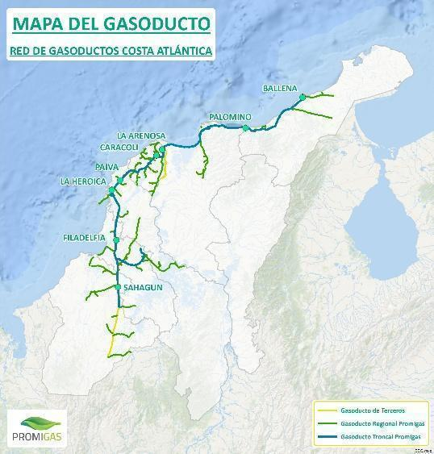{width="3.351383420822397in"
height="4.021660104986877in"}

######## Figura 7 Mapa de las redes de gasoductos en la costa caribe. FUENTE: Promigas (2025)

*LINK:
[[https://www.promigas.com/Beo/Paginas/ProcedimientosOperacionales/Mapa-del-gasoducto.aspx]{.underline}](https://www.promigas.com/Beo/Paginas/ProcedimientosOperacionales/Mapa-del-gasoducto.aspx)
  *

