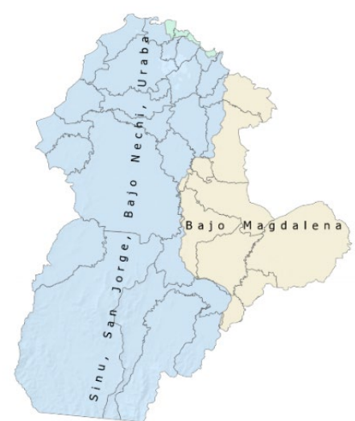
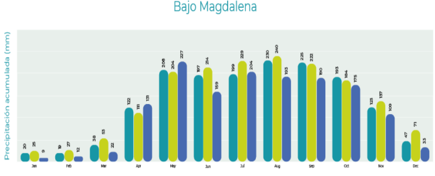
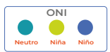
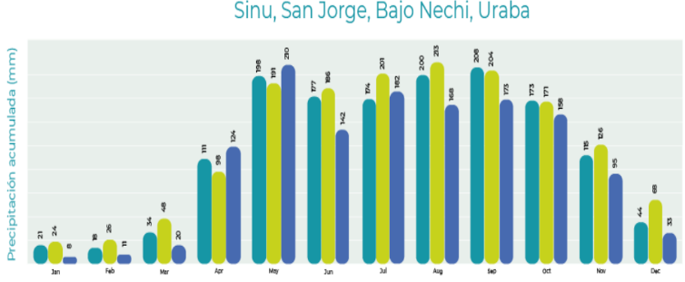
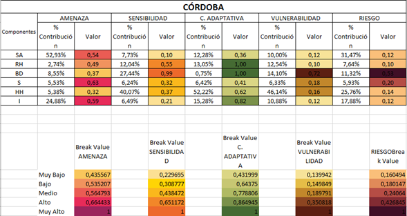
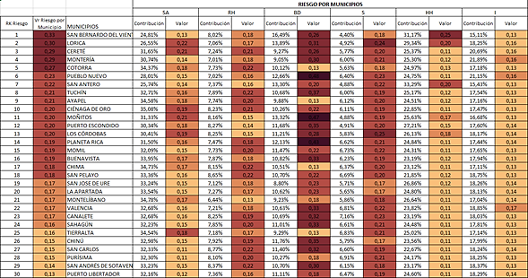
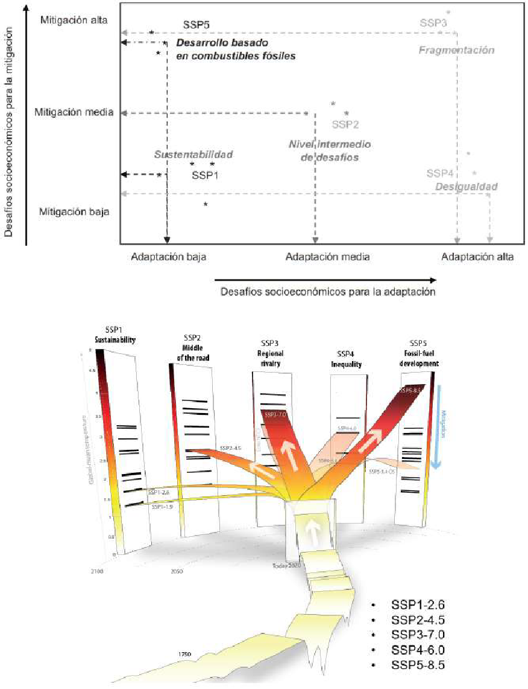
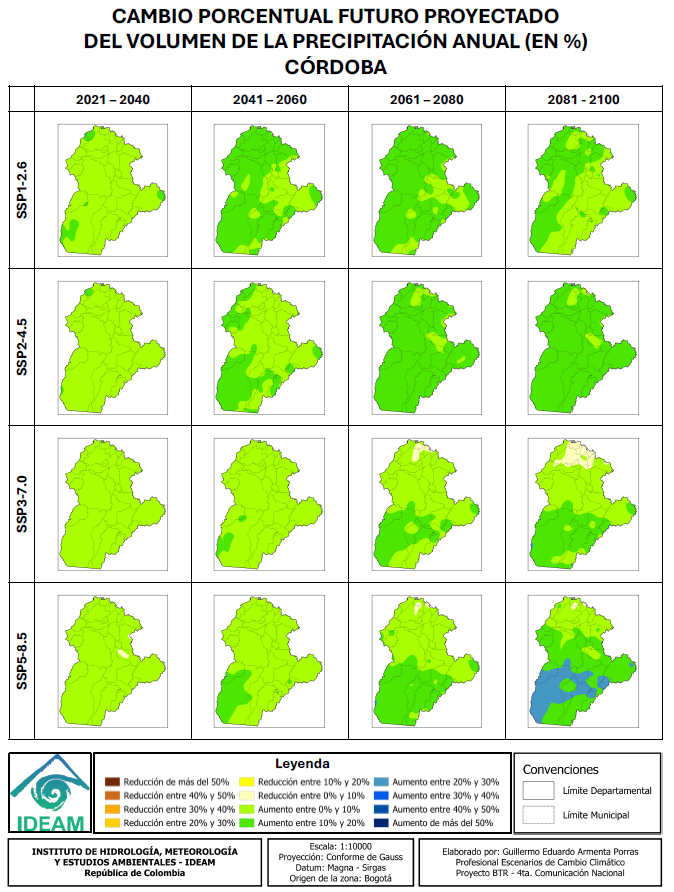
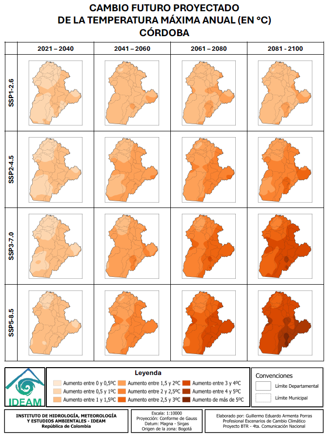

# 3. EL CLIMA EN EL DEPARTAMENTO 

### 3.1. Climatología en general.

De acuerdo con el análisis departamental realizado por el IDEAM (2014),
el departamento de Córdoba presenta dos regiones climáticas
diferenciadas en su territorio (ver Figura 6). Es importante destacar la
función de las estaciones climatológicas del IDEAM, instaladas en los
municipios de Chima, Ciénaga de Oro, Montería, Puerto Escondido y
Sahagún para el registro de los datos de temperatura máxima. El registro
de temperatura máxima para el departamento de Córdoba durante el periodo
1991--2020 fue de 35.3 °C.  

A.  Sinú, San Jorge, Bajo Nechí. (Color azul)

B.  Urabá y Bajo Magdalena. (Color amarillo) 

{width="2.072580927384077in"
height="2.399339457567804in"}

######## Figura 8 Regiones climáticas en el Departamento de Córdoba, pagina 7. Fuente: FAO-IDEAM (2022).

*LINK:
[[https://cambioclimatico.fao.org.co/wp-content/uploads/2023/06/13-CORDOBA_24.02.2023.pdf]{.underline}](https://cambioclimatico.fao.org.co/wp-content/uploads/2023/06/13-CORDOBA_24.02.2023.pdf)*

### 3.2. Temperatura promedio por región climática. 

-   En las regiones del Sinú, San Jorge, Bajo Nechí y Urabá, la
    temperatura máxima se sitúa entre 34,6 °C y 35,1 °C, la temperatura
    media varía entre 27,4 °C y 28 °C, y la mínima oscila entre 21,1 °C
    y 21,8 °C.

-   En la región del Bajo Magdalena, los valores son similares; sin
    embargo, se observan variaciones más marcadas en la temperatura
    mínima, que puede descender hasta los 20,7 °C en ciertos periodos. 

### 3.3. Precipitación acumulada.

Las lluvias en las regiones del Bajo Magdalena, es decir, en el Sinú, en
el San Jorge, en Bajo Nechí y el Urabá tienen un clima con una sola
temporada de lluvias al año. Las precipitaciones más fuertes se
presentan entre mayo y octubre, con el pico más alto en agosto para el
Bajo Magdalena y entre junio y julio para las otras regiones.

En cambio, la temporada seca ocurre en los primeros meses del año y al
final de diciembre, siendo enero y diciembre los meses con menos
lluvias. La cuenca del río Sinú recibe menos lluvia en comparación con
la región del Bajo Magdalena.

### 3.4. Variabilidad climática: en relación con los fenómenos de "el niño" y "la niña", utilizando registros del IDEAM (1975-2020).

{width="3.8845089676290465in"
height="1.3698589238845145in"}{width="1.2in"
height="0.6416666666666667in"}

{width="3.9583333333333335in"
height="1.4784722222222222in"}

{width="1.2in" height="0.6416666666666667in"}

######## 

######## Figura 9. Variabilidad climática del "Niño" y "Niña" en las regiones climáticas, páginas 10 y 11. Fuente: FAO (2022). 

*Link:
[[https://cambioclimatico.fao.org.co/wp-content/uploads/2023/06/13-CORDOBA_24.02.2023.pdf]{.underline}](https://cambioclimatico.fao.org.co/wp-content/uploads/2023/06/13-CORDOBA_24.02.2023.pdf)*

Estas gráficas de variabilidad climática proyectadas anteriormente,
demuestran que el fenómeno "*El Niño"* afecta principalmente el primer y
segundo trimestre del año, reduciendo las lluvias hasta en un 21 %, lo
que genera condiciones más secas durante esos meses. Por el contrario,
"*La Niña"* aumenta las lluvias en el segundo y tercer trimestre, justo
cuando suelen presentarse las precipitaciones más intensas, con aumentos
de más del 15 %.

Esto demuestra que ambos fenómenos climáticos tienen una fuerte
influencia en la distribución de las lluvias en estas regiones, y, por
tanto, son factores clave para la gestión del riesgo y la planificación
ambiental.

### 3.5. Tercera comunicación de cambio climático del IDEAM.

A continuación, se presentan lo indicadores de la tercera comunicación
de cambio climático del departamento de Córdoba y un breve análisis de
los escenarios de riesgo proyectados a futuro:

Convenciones:

+----------+----------+----------+-------+----------+----------+
| SA       | RH       | BD       | S     | HH       | I        |
|          |          |          |       |          |          |
| S        | Recurso  | Biodi    | Salud | Hábitat  | Infraes  |
| eguridad | Hídrico  | versidad |       | Humano   | tructura |
| Ali      |          |          |       |          |          |
| mentaria |          |          |       |          |          |
+----------+----------+----------+-------+----------+----------+

{width="4.2952755905511815in"
height="2.035113735783027in"}

######## Figura 10 Indicadores de la tercera comunicación de cambio climático del departamento. FUENTE: Tomado de IDEAM & UNGRD (2025).

######### Análisis general de los escenarios climáticos de la tercera comunicación.

Los indicadores del IDEAM enseñan unas proyecciones de valores para los
componentes o sectores principales para el desarrollo y sostenibilidad
de la comunidad, logrando estimar niveles diferenciados de amenaza,
sensibilidad, capacidad adaptativa, vulnerabilidad y riesgo según el
sector analizado.

Los componentes o sectores analizados fueron: Seguridad Alimentaria
(SA), Recurso Hídrico (RH), Biodiversidad (BD), Salud (S), Habitad
Humano (HH) e Infraestructura (I).

Los componentes con mayor peso en la estructura del riesgo son la
seguridad alimentaria (SA) y la infraestructura (I), ambos con valores
altos de amenaza (0,54 y 0,59 respectivamente), lo que refleja una alta
exposición ante eventos extremos como sequías, inundaciones y
variabilidad en la precipitación.

El modelo evidencia que estos impactos son consistentes con la
vulnerabilidad geográfica del departamento, ubicado entre la región
Caribe y el valle del Sinú, zonas fuertemente influenciadas por los
cambios en los patrones de lluvia y temperatura proyectados por los
modelos climáticos globales. El análisis de riesgo climático para el
departamento de Córdoba muestra que el componente de biodiversidad (BD)
presenta el mayor nivel de riesgo, con un valor de 0,53, clasificado
como muy alto, lo que indica una fuerte amenaza para los servicios
ecosistémicos. En contraste, los componentes de salud (HH),
infraestructura (I) y recurso hídrico (RH) tienen riesgos más bajos.

######### Vulnerabilidad y sensibilidad

La vulnerabilidad es más crítica en HH y BD, mientras que la capacidad
adaptativa es especialmente baja en BD, lo que agrava el riesgo. Estos
resultados resaltan la necesidad urgente de fortalecer acciones de
adaptación ambiental, especialmente en zonas con alta presión ecológica.

En otras palabras, los resultados de la sensibilidad indican que el
hábitat humano (HH) y la biodiversidad (BD) son los sistemas más
frágiles frente al cambio climático, con valores de 0,40 y 0,37
respectivamente. Esto significa que los ecosistemas y las poblaciones
humanas de Córdoba muestran una alta respuesta negativa a pequeñas
variaciones climáticas, debido a la degradación ambiental,
deforestación, expansión agropecuaria y urbanización sin control.

En contraste, el recurso hídrico (RH) y la salud (S) presentan niveles
de sensibilidad moderados, lo que sugiere que las fuentes de agua y los
sistemas de atención sanitaria podrían mantener cierto grado de
resiliencia si se implementan medidas preventivas.

######### Capacidad adaptativa y desigualdades territoriales

El componente de capacidad adaptativa revela una situación preocupante:
la mayoría de los sectores claves muestran valores bajos (inferiores a
0,6), salvo el recurso hídrico y la biodiversidad, que alcanzan valores
de 1, indicando mayor posibilidad de respuesta institucional y
ambiental. Esto refleja una asimetría adaptativa, donde los ecosistemas
naturales conservan una capacidad de recuperación más alta que las
comunidades humanas o la infraestructura física.

Los municipios con mayores valores de riesgo total, como San Bernardo
del Viento, Lorica, Cereté y Montería, se localizan en zonas bajas y
costeras del Sinú y San Jorge, las cuales son altamente expuestas a
inundaciones y aumentos del nivel del mar, según los escenarios
modelados a 2040--2070.

{width="5.855544619422572in"
height="3.258251312335958in"}

######## Figura 11 Indicadores de cambio climático por municipio del departamento de Córdoba. Fuente: Tomado de IDEAM (2022).

######### Conclusiones

Como se observa el departamento de Córdoba clasifica como riesgo muy
alto por diversidad, es decir, amenaza que el cambio climático
representa para la pérdida de servicios ecosistémicos y riesgo medio en
el indicador de salud, lo cual se refiere a un nivel de riesgo moderado
que enfrenta la población debido a los impactos del cambio climático en
la salud pública. Los cinco municipios del departamento en el riesgo muy
alto por los seis indicadores de la tercera comunicación son: *San
Bernardo del Viento, Lorica, Cereté, Montería, Cotorra.*

San Bernardo del Viento, por ejemplo, evidencia un alto riesgo en
salud (0.25) y biodiversidad (0.18), lo que resalta la urgencia de
implementar acciones de prevención y adaptación. En contraste,
municipios como *San Carlos, Chinú y Purísima* presentan un riesgo
medio a bajo, lo que permite orientar estrategias diferenciadas de
intervención.

En conjunto, los resultados del IDEAM proyectan que Córdoba
experimentará un aumento en la frecuencia e intensidad de los eventos
climáticos extremos, especialmente lluvias intensas, inundaciones
costeras y estrés hídrico en zonas agrícolas. El componente de
biodiversidad (valor 0,53) representa el mayor nivel de riesgo, seguido
del hábitat humano y la infraestructura, lo que implica una amenaza
combinada sobre los ecosistemas y la calidad de vida de la población.

La vulnerabilidad estructural, sumada a la baja capacidad de adaptación
en sectores rurales, advierte sobre la necesidad urgente de fortalecer
la planificación ambiental, la gestión del riesgo y las estrategias de
adaptación local, priorizando municipios del litoral y cuenca media del
Sinú, donde la presión ecológica y el cambio climático convergen con
mayor intensidad.

### 3.6. Cuarta comunicación de cambio climático 

En su reciente actualización, el IDEAM hace referencia al documento
Escenarios de Cambio Climático en Colombia (2025), basándose en las
bases físicas del Sexto Informe de Evaluación (en adelante, AR6); este
hito fue elaborado el 2021 por un Grupo Intergubernamental de Expertos
sobre el Cambio Climático (en adelante, IPCC). Este informe presenta los
experimentos y las modelaciones generadas en la sexta fase del proyecto
de intercomparación de modelos acoplados para los escenarios de cambio
climático del territorio nacional (en adelante, CMIP6). El proyecto
incluye simulaciones a largo plazo del clima en el siglo XX y
proyecciones para el siglo XXI, así como algunas para el siglo XXII
desde nuevos escenarios llamados trayectorias socioeconómicas
compartidas (en adelante, SSP).

En la actualidad, el proyecto CMIP6 lo integran 88 grupos
internacionales de modelación, los cuales utilizan modelos acoplados
océano-atmósfera (AOGCM), y algunos usan los Earth System Models; estos
últimos, además de la atmósfera y el océano, incluyen en sus
simulaciones la vegetación y el ciclo de carbono interactivo (IPCC,
2021). De tal modo, los modelos son la única herramienta disponible
actual para hacer un análisis climático futuro, y solo algunas
instituciones como universidades, centros meteorológicos y de
investigación en clima logran tener la capacidades tecnológicas,
físicas, investigativas y de personal para desarrollar o correr este
tipo de modelos.

Es importante recordar que un escenario de cambio climático es una
descripción coherente,

consistente y convincente de un posible estado futuro del clima.

Por lo tanto, los escenarios no deben asumirse como pronósticos o
predicciones, sino como una imagen alternativa de cómo el futuro puede
mostrarse desde determinadas condiciones en un tiempo dado (Fundación
Biodiversidad et al., 2013). Por lo general, se utiliza un conjunto de
ellos con el fin de mostrar, de la mejor manera, el rango de
incertidumbre en las proyecciones climáticas ante diferentes
combinaciones de condiciones económicas, medioambientales, de
crecimiento poblacional, políticas, entre otras (Instituto de
Hidrología, Meteorología y Estudios Ambientales, 2015).

En términos generales, los expertos del IPCC establecen cinco escenarios
posibles (SSP), y son los siguientes:

-   SSP1 ("sustentabilidad"). Este escenario tiene los siguientes
    supuestos: bajo crecimiento de la población, alto crecimiento
    económico, altos niveles de educación, gobernabilidad, una sociedad
    globalizada, cooperación internacional, desarrollo tecnológico y
    conciencia ambiental. Teniendo en cuento lo anterior, este escenario
    representa bajos niveles de desafíos de mitigación y adaptación.

-   SSP3 ("fragmentación"). En este escenario se asumen: alto
    crecimiento poblacional y bajo desarrollo económico, niveles
    inferiores de educación y una sociedad regionalizada y con poca
    conciencia ambiental, lo cual representa un nivel alto de desafíos
    para la adaptación y la mitigación.

-   SSP4 ("desigualdad"). Desde este escenario, la tecnología avanza en
    los países desarrollados, pero no toda la población logra
    beneficiarse de ella; esto representa un nivel alto para la
    adaptación.

-   SSP5. Este escenario asume que aún se tiene una muy alta dependencia
    de los combustibles fósiles y un bajo crecimiento en la población,
    así como un elevado crecimiento económico y un alto desarrollo
    humano, por lo que representa un nivel alto de desafío para la
    mitigación.

-   SSP2. Este es un escenario intermedio, en el cual los supuestos
    están entre los que corresponden a los SSP1 y SSP3.

{width="4.635663823272091in"
height="6.308333333333334in"}

######## Figura 12 ESCENARIOS DE CAMBIO CLIMATICO PROYECTADOS POR AR 6. FUENTE: Escoto Castillo et al . (2017)

Link:[[https://drive.google.com/file/d/1QOJ5VKz6-xRtQN1GHx6x03Izj7V965cq/view?usp=drive_link]{.underline}](https://drive.google.com/file/d/1QOJ5VKz6-xRtQN1GHx6x03Izj7V965cq/view?usp=drive_link)

Con base en las definiciones anteriores, en las siguientes secciones se
exponen las proyecciones climáticas futuras de precipitación,
temperaturas media, máxima y mínima, humedad relativa, velocidad del
viento y radiación para el siglo XXI, las cuales corresponden a los
escenarios de cambio climático que se deben incorporar en la Cuarta
Comunicación Nacional de Colombia.

######### Análisis general de los escenarios climáticos SSP

Para el departamento de Córdoba, estos escenarios permiten anticipar
cómo las decisiones globales en materia de energía, economía y
gobernanza podrían modificar las condiciones de temperatura y
precipitación hacia el año 2100.

Según los mapas de la ECC4CN, las proyecciones para Córdoba muestran
reducciones en la precipitación anual entre --2,6 % (SSP1) y --8,5 %
(SSP5), y un aumento sostenido de las temperaturas máximas y mínimas,
especialmente hacia finales del siglo. Estas variaciones implican
alteraciones significativas en el balance hídrico, la productividad
agrícola y la estabilidad de los ecosistemas del Caribe interior
colombiano.

Referente al comportamiento de la precipitación: Los resultados del
IDEAM indican que bajo escenarios de sustentabilidad (SSP1), Córdoba
experimentaría una leve disminución de la precipitación (--2,6 %), lo
que sugiere un futuro relativamente estable si se mantienen políticas de
mitigación y manejo ambiental sostenido. Sin embargo, bajo SSP2 y SSP3,
la reducción oscila entre --4,5 % y --7 %, evidenciando un deterioro
progresivo de las lluvias y una mayor probabilidad de déficits hídricos
estacionales en cuencas como el Sinú y el San Jorge. El escenario más
crítico, SSP5 (--8,5 %), proyecta un contexto de aridez extendida, con
afectación directa sobre la recarga de acuíferos, disponibilidad de agua
para riego y regulación hídrica de humedales y ciénagas. En síntesis, la
tendencia general apunta a un descenso gradual en las lluvias anuales,
acompañado de un aumento en la irregularidad interanual y mayor riesgo
de sequías prolongadas.

Referente a las tendencias de temperatura: Las proyecciones térmicas
revelan un aumento sostenido de la temperatura media anual en Córdoba,
tanto en los valores máximos como mínimos. El incremento de la
temperatura máxima se proyecta entre +1,5 °C y +3 °C hacia mediados de
siglo, y podría alcanzar +4 °C o más bajo los escenarios SSP3 y SSP5
para finales del siglo XXI. Paralelamente, la temperatura mínima aumenta
en rangos similares, lo cual reduce la amplitud térmica diaria y
modifica los ciclos de evapotranspiración. Este calentamiento homogéneo
podría provocar estrés térmico en cultivos tropicales, reducción de
rendimientos agrícolas y mayor demanda energética por refrigeración en
centros urbanos como Montería y Lorica. A nivel ecosistémico, se espera
un desplazamiento altitudinal de especies, pérdida de hábitats húmedos y
afectación a la biodiversidad ribereña del Sinú.

{width="4.455980971128609in"
height="5.8969411636045495in"}

######## Figura 13 TENDENCIAS Y PROYECCIONES PARA LOS ESCENARIOS DE PRECIPITACION AL DEPARTAMENTO DE CORDOBA. FUENTE: IDEAM (2025)

LINK:
[[https://drive.google.com/file/d/1F0r1mJKU387P8f3dV2EZAcpNrfoGNYoS/view?usp=drive_link]{.underline}](https://drive.google.com/file/d/1F0r1mJKU387P8f3dV2EZAcpNrfoGNYoS/view?usp=drive_link)

{width="4.154166666666667in"
height="5.341666666666667in"}

######## Figura 14 TENDENCIAS Y PROYECCIONES PARA LOS ESCENARIOS DE TEMPERATURAS MAXIMAS ANUALES EN EL DEPARTAMENTO DE CORDOBA. FUENTE: IDEAM (2025)

LINK:
[[https://drive.google.com/file/d/15QFMh3ZtMu5xEWg17UpTwH7_JftKZ0TV/view?usp=drive_link]{.underline}](https://drive.google.com/file/d/15QFMh3ZtMu5xEWg17UpTwH7_JftKZ0TV/view?usp=drive_link)

######### Conclusiones e interpretaciones finales.

En resumen, los escenarios climáticos del IDEAM advierten que Córdoba
será más cálido y más seco en todos los escenarios futuros, con mayor
severidad bajo trayectorias de desarrollo insostenible (SSP3 y SSP5). La
reducción de lluvias y el incremento térmico se traducen en mayor
vulnerabilidad hídrica, afectando la agricultura, la ganadería y los
ecosistemas acuáticos que sustentan la economía y el bienestar regional.
Los municipios del medio y bajo Sinú ---como Cereté, Lorica, San
Bernardo del Viento y Purísima--- enfrentarán un riesgo combinado de
sequías, pérdida de productividad y deterioro de la calidad del agua,
mientras que los sectores costeros podrían sufrir intrusión salina y
degradación de humedales costeros.

En términos de gestión del riesgo y adaptación, los escenarios SSP
enfatizan la necesidad de fortalecer políticas de ordenamiento
territorial climático, conservación de fuentes hídricas, transición
energética y agricultura resiliente. Córdoba deberá priorizar
estrategias basadas en gestión integral del agua, restauración de
cuencas, monitoreo climático local y educación ambiental, con el fin de
reducir su exposición ante los impactos del cambio climático. En los
escenarios más sostenibles (SSP1--SSP2), la región aún puede estabilizar
su balance hídrico, pero bajo trayectorias de fragmentación o
dependencia fósil (SSP3--SSP5), el riesgo de degradación ambiental y
pérdida socioeconómica será alto y creciente hacia finales del siglo.

