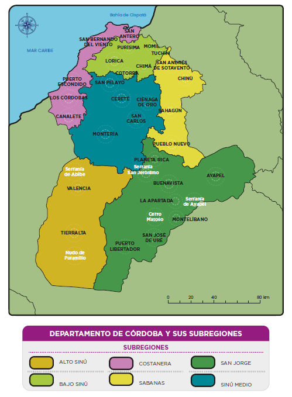
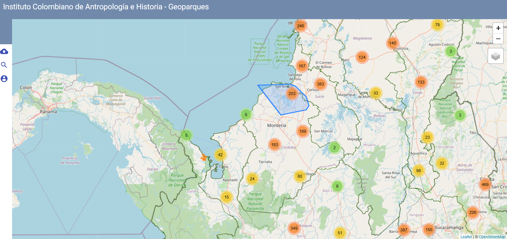
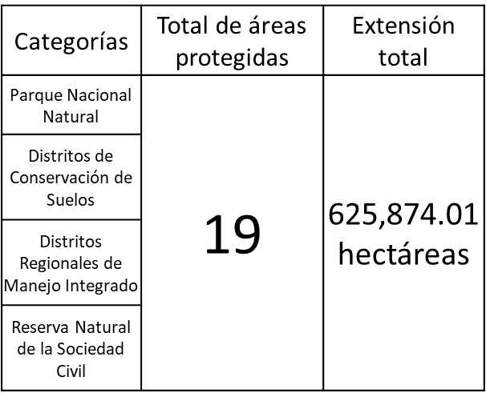
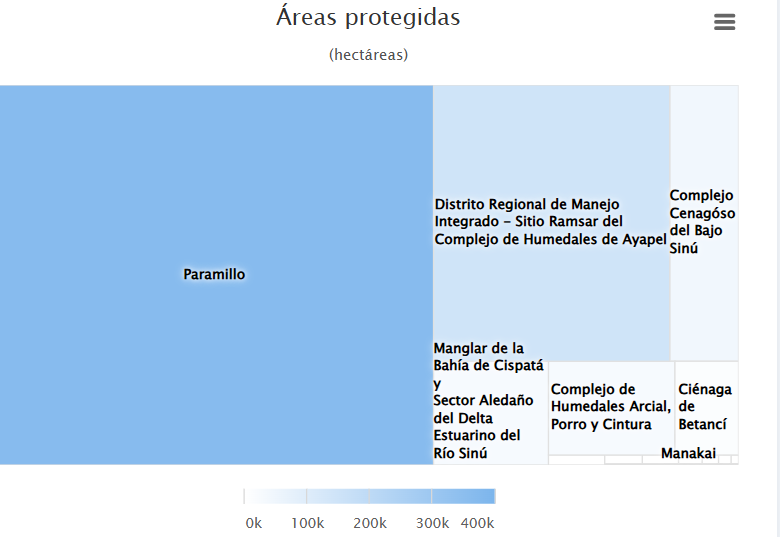
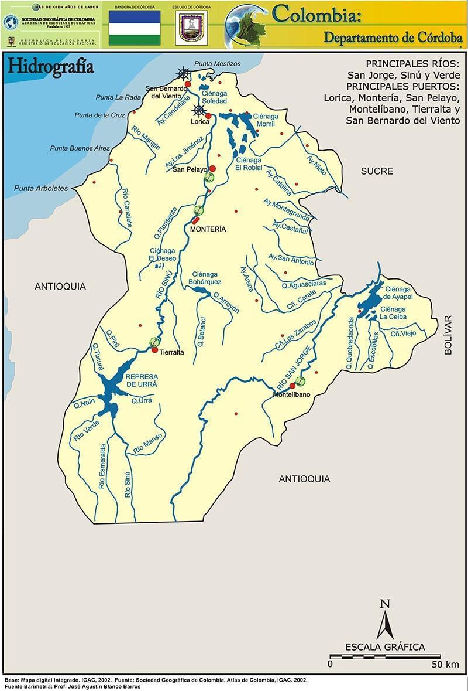

# 4. ÁREAS DE IMPORTANCIA AMBIENTAL DEPARTAMENTAL

Es importante mencionar, el departamento de Córdoba forma parte del bloque de la región Caribe y representa 23.980 km2 del territorio nacional. Cuenta con 30 municipios y en un territorio determinado geográficamente por las serranías de Abibe, San Jerónimo y Ayapel.

Desde el sur del departamento muestra una región montañosa, en la que se encuentra una fracción del Parque Nacional Natural Paramillo, que es una de las mayores concentraciones de biodiversidad representativa para el país y lugar de nacimiento de los ríos Sinú y San Jorge. Sus sistemas montañosos, que llegan a la zona costera, presentan alturas de hasta 2.200 msnm. De esta manera su orografía, su hidrografía (ríos San Jorge, Sinú y Canalete) y su íntima relación con la costa.

En un informe del año 2005, la CVS, muestra la subregionalización ambiental del departamento, que presenta un alto grado de homogenización geográfica y ambiental, e integra los nuevos municipios creados con la Constitución de 1991, la cual se disgrega así:

I.  Alto Sinú, constituida por los municipios de Tierralta y Valencia.

II. Medio Sinú, constituida por los municipios de Montería, Cereté, Ciénaga de Oro, San Carlos y San Pelayo.

III. Bajo Sinú, constituida por los municipios de Lorica, Purísima, Momil, Chimá, Cotorra, y Tuchín.

IV. Sabanas, constituida por los municipios de Sahagún, Chinú, Pueblo Nuevo y San Andrés de Sotavento.

V.  San Jorge, constituida por los municipios de Planeta Rica, Montelíbano, Buenavista, Puerto Libertador, Ayapel y San José de Uré.

VI. Costanera, constituida por los municipios de San Antero, San Bernardo del Viento, Moñitos, Los Córdobas, Canalete y Puerto Escondido.

{width="4.365534776902887in" height="5.940277777777778in"}

######## Figura 15 Mapa de las subregiones ambientales del departamento. FUENTE: Fundación Herencia Ambiental Caribe (2020)

### 4.1. Parques nacionales naturales (PNN).

Extensión (km2): Según la dirección del PNN (2025), el departamento de Córdoba dentro de su jurisdicción tiene dos (2) PNN declarados, su extensión aproximada es de 646.838 Hectáreas. Sus nombres son: PNN Corales de profunda y PNN Paramillo.

En el departamento de Córdoba, el PNN Paramillo protege una amplia zona montañosa que abarca municipios como *Tierralta, Montelíbano y Puerto Libertador*, donde se conservan selvas húmedas tropicales, fuentes hídricas como el río Sinú y hábitats de especies como el jaguar y el mono aullador. Por otro lado, el PNN Corales de Profundidad se localiza en el mar Caribe, frente a las costas de *San Bernardo del Viento y Moñitos*, y resguarda ecosistemas marinos únicos con corales, peces tropicales y tortugas. Ambos parques son fundamentales para la conservación ambiental y el equilibrio ecológico en Córdoba.

NÚMERO DE HECTÁREAS DE PNN EN EL DEPARTAMENTO DE CÓRDOBA

  ------ -------- ------------------------- -----------------
  Nro.   Región   Nombre                    Extensión (Has)
  1      Caribe   PNN Corales de Profunda   142.195
  2      Caribe   PNN Paramillo             504.643
  ------ -------- ------------------------- -----------------

[]{#_Toc216552977 .anchor}Tabla 7 Número de parques Nacionales Naturales en el departamento. FUENTE: PNN (2025).

### 4.2. Áreas arqueológicas protegidas.

La autoridad en Colombia en materia de patrimonio arqueológico es el Instituto Colombiano de Antropología e Historia (ICANH)[^1], el cual registra los hallazgos y bienes arqueológicos del país, y además declara las áreas arqueológicas protegidas en el territorio nacional. El Instituto Colombiano de Antropología e Historia tiene un geoportal en su página web, donde muestra la ubicación de los sitios arqueológicos. Se anexa el link en las referencias.

En Córdoba, estos registros se presentan de forma global: un solo sitio puede incluir varios yacimientos. Por ejemplo, en la región del medio y bajo río San Jorge, se han identificado 134 sitios arqueológicos según estudios previos. Es importante aclarar que esta información es preliminar y debe validarse con exploraciones arqueológicas en el territorio.

Los municipios con registros arqueológicos fueron: Ayapel, Buenavista, Montelíbano, Planeta Rica, Pueblo Nuevo, Puerto Libertador, San Marcos. (Ver la Tabla 8)

[]{#_Toc216552978 .anchor}Tabla 8 Hallazgos arqueológicos en el departamento. Fuente: ICANH (2025).

  ------------------- ----------------------------------------------------
  Municipio       N° De hallazgos arqueológico en los municipios
  Ayapel              9
                      
  Buenavista          4
                      
  Montelíbano         45
                      
  Planeta Rica        14
                      
                      
  Pueblo Nuevo        2
                      
  Puerto Libertador   19
                      
                      
  San Marcos          1
  ------------------- ----------------------------------------------------

{width="5.023319116360455in" height="2.378659230096238in"}

######## Figura 16 Visor web del ICANH. Fuente: <https://geoparques.icanh.gov.co/#/>

### 4.3. Ecosistemas estratégicos.

La creación del Sistema de Áreas Protegidas en Colombia se basa en un enfoque que busca conservar los ecosistemas. Para su gestión, se creó el Registro Único Nacional de Áreas Protegidas (RUNAP), según lo establecido en los Decretos 2372 de 2010 y 3572 de 2011. Esta herramienta es administrada por Parques Nacionales Naturales de Colombia y permite que cada Autoridad Ambiental registre las áreas protegidas que tiene a su cargo, a través de una plataforma nacional.

Según el Registro Único Nacional de Áreas Protegidas (RUNAP), en el departamento de Córdoba existen 19 áreas protegidas inscritas, registradas y declaradas por la Autoridad ambiental departamental (CVS, 2020).

Link del RUNAP para Córdoba: *[<https://runap.parquesnacionales.gov.co/area-protegida/215>]{.underline}*

[]{#_Toc216552979 .anchor}Tabla 9 Ecosistemas estratégicos registrados en el RUNAP.
Fuente: Autores adaptado del RUNAP (2025).

{width="1.6604166666666667in" height="1.2666404199475065in"}

{width="3.9496883202099737in" height="2.1892825896762904in"}

######## Figura 17 Áreas protegidas en el Departamento de Córdoba. Fuente: RUNAP -- PNN (2025).

Este gráfico muestra las áreas protegidas en el departamento de Córdoba, destacando su tamaño en hectáreas. El Parque Nacional Natural Paramillo es, con gran diferencia, el área protegida más extensa, superando las 400 mil hectáreas. Le siguen el Distrito Regional de Manejo Integrado del Complejo de Humedales de Ayapel y el Complejo Cenagoso del Bajo Sinú, que también representan zonas claves de conservación ambiental. Áreas como el Manglar de la Bahía de Cispatá y los complejos de humedales cumplen un papel vital en la protección de ecosistemas costeros y de agua dulce. Este tipo de conservación es fundamental para preservar la biodiversidad, el agua y los medios de vida de comunidades locales.

### 4.3.1. Tipos de ecosistemas estratégicos.

En el departamento de Córdoba existe una serie de ecosistemas estratégicos, los cuales han surtido un proceso de delimitación y zonificación. A continuación, se describen los tipos de ecosistemas y las extensiones representadas en hectáreas con las que cuenta el departamento de Córdoba, se resalta en negro las extensiones más altas en el departamento. 

[]{#_Toc216552980 .anchor}Tabla 10 Tipos de ecosistemas en el Departamento de Córdoba. Fuente: CVS (2022).

  ----------------------- --------------------------------------------- --------------------
  Tipología           Nombre                                    Extensión (Ha)
  Humedal                 DMI CISPATA                                   27.171
  Ciénaga                 Complejo Cienagoso del Bajo Sinú              42.013
  Ciénaga                 Complejo Baño y los Negros                    1.039
  Ciénaga                 Corralito                                     1.264
  Humedal                 Sierra Chiquita, Los Araujos y el Batallón.   763.5
  Ciénaga                 Betancí                                       13.415
  Ciénaga                 Arcial, Porro y Cintura                       26.404
  Complejo de Humedales   Ayapel                                        145.512
  Humedal                 Pantano pareja                                2.090
  Bosque                  Cerro Colosina                                668.4
  Humedal                 Las Marias                                    3.594
  Bosque                  Cerro Laguneta                                427.38
  ----------------------- --------------------------------------------- --------------------

### 4.4. Cuencas hidrográficas.

Dentro de la jurisdicción departamental, la CVS, el Instituto de Hidrología, Meteorología y Estudios Ambientales (IDEAM) ha identificado seis cuencas hidrográficas: Río Alto Sinú, Río Medio-Bajo Sinú, Río Alto San Jorge, Río Bajo San Jorge, Río Canalete-Río Los Córdobas, Río Mangle y otros arroyos directos del Caribe. Además de los arroyos directos del Golfo de Morrosquillo, cuya extensión dentro del departamento de Córdoba es mínima. Asimismo, la región cuenta con seis acuíferos y una gran cantidad de cuerpos de agua, incluyendo ciénagas, arroyos, embalses y represas.

[]{#_Toc216552981 .anchor}Tabla 11 Fuentes hídricas en jurisdicción del departamento de Córdoba. Fuente: Autor (2024).

  ---------- --------------------------------------- ---------------
  Nro.   Cuenca                              Área (Ha)
  1          Rio Alto Sinú                           376.410
  2          Rio Medio y bajo Sinú                   941.476
  3          Rio San Jorge Alto                      376.410
  4          Rio San Jorge Bajo                      626.085
  5          Rio Canalete-Rio Los Cordobas           119.138
  6          Rio Mangle y otros arroyos del Caribe   11.746
  ---------- --------------------------------------- ---------------

A continuación, se expone el mapa de la distribución de la red hidrográfica del departamento de Córdoba, en base del mapa digital del IGAC (2002), este insumo grafico permite visualizar los principales ríos, los cuerpos de agua más representativos del departamento, las cabeceras municipales (color rojo) y puertos fluviales y marítimos en el departamento. (Ver Figura 17)

{width="2.0846959755030623in" height="3.3104975940507435in"}

######## Figura 18 Mapa hidrográfico del departamento de Córdoba. FUENTE: Sociedad Geográfica de Colombia

