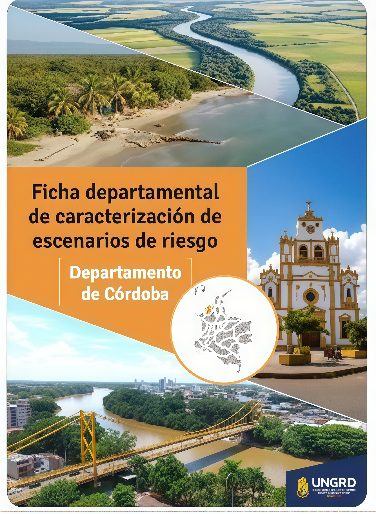
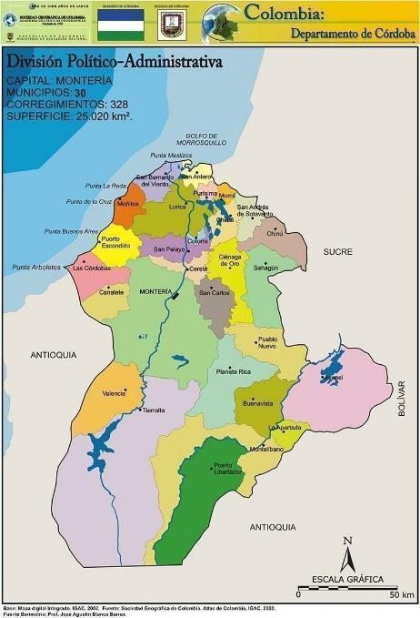
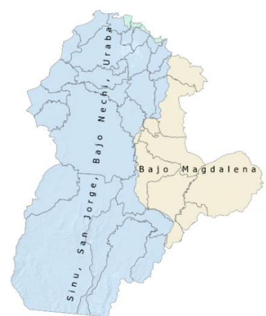
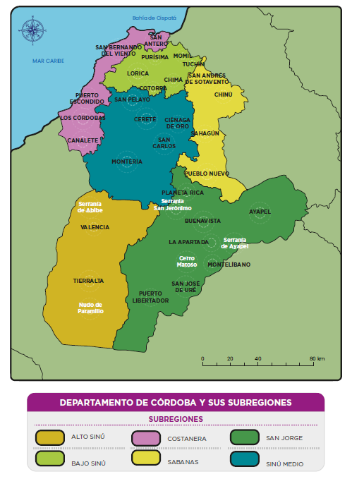
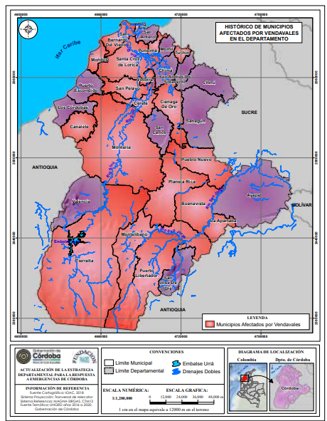

# Inicio

{.ungrd-cover-float}

La **Ficha Departamental de Caracterización de Escenarios de Riesgo del Departamento de Córdoba** se constituye en un insumo técnico elaborado a partir de la consolidación de información institucional existente, con el propósito de fortalecer los procesos de planificación territorial y de gestión del riesgo de desastres.

Este documento está dirigido a tomadores de decisión —alcaldes, gobernadores, coordinadores departamentales y municipales de gestión del riesgo de desastres—, así como a la población académica y a los profesionales de apoyo de las administraciones públicas, quienes requieren información veraz, clara y actualizada para orientar acciones preventivas y de reducción del riesgo en el territorio.

La ficha integra, mediante gráficas, mapas e infografías, los principales elementos relacionados con las determinantes ambientales, socioeconómicas y las amenazas de origen natural, socio-natural y tecnológico (NaTech), que inciden en la seguridad y el bienestar de la población. De esta manera, se configura como una herramienta estratégica para la toma de decisiones fundamentadas, la gestión prospectiva y correctiva del riesgo, y la construcción de territorios más seguros, sostenibles y resilientes.

::: {.clearfix}
:::

::: {.d-flex .justify-content-start .mb-3}
[← Volver al Portal de Riesgo Colombia](https://portal-riesgo-colombia.ungrd.gov.co){.ungrd-btn}
:::

------------------------------------------------------------------------

::::: {.ungrd-cards-grid}

::: {.ungrd-card}
::: {.ungrd-card-header}
[Capítulo 2: Caracterización territorial y ambiental](02_capitulo.html)
:::
::: {.ungrd-card-body}
{class="ungrd-card-img"}

Ubicación, límites geográficos y división político-administrativa del departamento de Córdoba, con sus 30 municipios y principales rasgos territoriales.
:::
:::

::: {.ungrd-card}
::: {.ungrd-card-header}
[Capítulo 3: El clima en el departamento](03_capitulo.html)
:::
::: {.ungrd-card-body}
{class="ungrd-card-img"}

Regiones climáticas, estaciones de monitoreo del IDEAM y escenarios de cambio climático que afectan la disponibilidad hídrica y la vulnerabilidad del territorio.
:::
:::

::: {.ungrd-card}
::: {.ungrd-card-header}
[Capítulo 4: Áreas de importancia ambiental departamental](04_capitulo.html)
:::
::: {.ungrd-card-body}
{class="ungrd-card-img"}

Subregionalización ambiental, ecosistemas estratégicos y áreas protegidas que determinan la oferta ambiental y la ordenación del territorio cordobés.
:::
:::

::: {.ungrd-card}
::: {.ungrd-card-header}
[Capítulo 5: Identificación de escenarios de riesgo](05_capitulo.html)
:::
::: {.ungrd-card-body}
{class="ungrd-card-img"}

Antecedentes históricos de emergencias y caracterización de los escenarios de riesgo natural, socio-natural y tecnológico identificados en el departamento.
:::
:::

:::::

------------------------------------------------------------------------

## Navegación

Utiliza la navegación lateral o las tarjetas superiores para explorar los diferentes capítulos de la ficha departamental.
